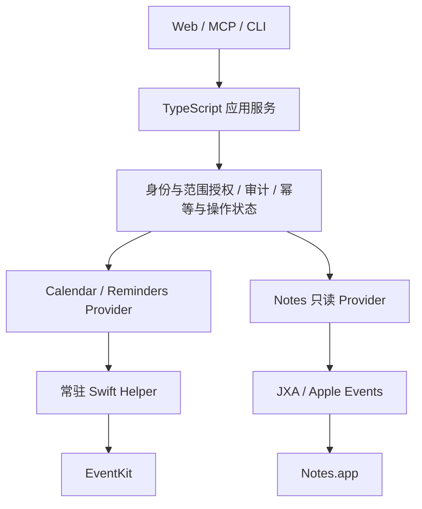

# Apple Connector v0.5.0 计划：TypeScript + 常驻 Swift Helper

状态：主方案已实现并完成本机分层性能验证；最终安装、签名与跨环境验收仍按验收清单跟踪。
更新日期：2026-09-07
进度记录：[v0.5.0-progress.md](./v0.5.0-progress.md)

## 1. 目标与架构决策

保留 TypeScript 应用服务，引入常驻 Swift helper，统一通过 EventKit 访问 Calendar 和 Reminders。Notes 使用独立的 JXA / Apple Events 只读 provider，仅提供文件夹发现、搜索和详情读取。主要目标是提高提醒事项新增的可靠性和响应速度，减少原生调用开销，并统一日历、提醒事项的权限、查询和写入实现。

用户已确认采用此架构。性能收益主要来自替换 Apple Events 访问路径、复用 EventKit 会话和减少跨进程往返；不能仅凭更换语言承诺性能提升。

本计划制定时不自动升级 package 版本；在用户明确要求提交 v0.5.0 后，package 版本升至 `0.5.0`。v0.3.0 / v0.4.0 尚未完成的历史验收不因此视为完成。已有授权、审计、Web 管理身份、MCP 入口及写入幂等语义继续保留。

## 2. 当前基线与问题

| 功能 | 当前实现 | 本期方向 |
| --- | --- | --- |
| Reminders 条目读取 | JXA 通过 Objective-C bridge 调用 EventKit | 迁移至 Swift EventKit provider |
| Reminders 清单发现/读取 | 仍有 Apple Events 路径 | 统一使用 EventKit 容器发现与解析 |
| Reminders 新增 | Apple Events 分别执行预检、创建、核验 | helper 内执行 EventKit 保存及按 ID 回读核验 |
| Calendar 读取 | Apple Events 枚举事件并逐属性读取、过滤 | EventKit 时间范围 predicate 查询 |
| Notes 读写 | JXA / Apple Events 控制 Notes.app，已有新增入口 | 收敛为只读 provider，关闭对外写入入口，隔离阻塞 |
| 原生运行器 | 每次请求启动 osascript；每个 runner 内串行排队 | 常驻 helper、受控队列和生命周期管理 |

已有记录显示，同一提醒清单的 EventKit 读取从 Apple Events 超过 60 秒改善到 218 ms（返回 1 条）。这是历史单场景读取证据，不代表新增耗时或大数据量表现，见 [v0.4.0 进展](./v0.4.0-progress.md)。

Calendar 曾出现 EventKit 报告完整访问但找不到 `Agents` 日历的情况，见 [原生验证记录](./native-validation.md)。迁移前必须查明实际账户、容器可见性及执行宿主差异，不能仅凭授权状态启用新路径。

## 3. 分层设计

### TypeScript 服务职责

- 保留传输入口、参数契约、Web 会话、客户端授权和范围限制。
- 负责持久化操作意图、幂等键、回执、审计及重启后的未知状态恢复。
- provider 面向业务能力定义接口，不把 `JxaRunner` 作为 Calendar / Reminders 的公共依赖；原生传输细节集中在 helper client。
- 调度 helper 生命周期、协议握手、队列上限、超时和健康状态；将脱敏错误映射到现有用户界面及服务契约。
- Web 管理操作和 MCP 客户端操作保留各自身份，不通过伪造全权限客户端统一调用。

### Swift helper 职责

- 管理 EventKit 授权状态、授权请求、容器发现、查询、保存、按 ID 回读及变更通知。
- 复用 `EKEventStore`；EventKit 对象和 predicate 留在所属 store 的执行上下文，不跨 store 混用，不通过 IPC 传递原生对象。
- 使用明确隔离的执行器/队列管理 EventKit 访问和回调；遵守实际 SDK 并发约束，不将原生对象当作任意线程可共享的数据。
- 只接受固定操作和结构化参数，复核动作、目标容器、字段边界与可写状态，不提供任意 Swift、JXA 或 shell 执行。
- 返回业务 DTO、原生标识、核验结果及脱敏阶段耗时；不自行决定客户端权限或绕过 TypeScript 应用服务。

### Notes 边界

EventKit 不提供 Apple Notes 笔记 CRUD；事件/提醒事项的 `notes` 属性只是备注。用户已明确 Notes 只需要读取。本期仅提供文件夹发现、搜索和详情读取，继续使用现有脚本接口及共享、锁定等能力限制。Swift 化 Apple Events 调用本身不能消除 Notes.app 的处理延迟。

Web 移除 Notes 新增表单；MCP / CLI / RPC 等实际存在的对外入口不再暴露或执行 Notes 新增、修改、删除。服务端同步关闭写入能力，不能仅隐藏 UI；历史操作状态与审计保留可查询，不恢复或重放未决 Notes 写入。旧 writer 是否删除由实现时依赖检查决定，不影响只读边界。Notes 验收仅做读取，不运行创建/删除笔记的探针。

## 4. IPC 与常驻进程生命周期

- 初期采用服务托管子进程和 stdin/stdout JSON Lines 通信，不新增公开监听端口；stdout 只输出协议，stderr 仅输出脱敏诊断。
- 请求包含协议版本、请求 ID、业务操作 ID（写入时）、固定动作及结构化 payload；响应明确关联请求并区分成功、确定失败和结果未知。
- 定义请求/响应字节上限、增量解析、背压、在途请求上限和协议异常处理；长驻协议不能沿用读到 EOF 才解析单次请求的实现。
- 握手返回 helper 版本、协议版本和支持动作；不兼容时拒绝调用并显示修复指引，不静默解释不匹配消息。
- 每个服务实例托管一个 helper，按需启动后复用；正常停止时停止接收请求、有限等待在途工作并关闭子进程，避免遗留孤儿进程。
- 崩溃、失联或卡死后允许有界退避重启；重启恢复可用性，不自动重放已发送写入。区分排队未发送、已发送和已收到确定回执的请求。
- 将 Notes 与 EventKit 工作按 provider 隔离队列，确保 Notes 读取不等待 EventKit 写入队列；同一写入路径仍保证顺序、幂等和数据库一致性。
- EventKit 通知与授权状态变化触发相关缓存失效；权限撤销后禁止继续从缓存返回受保护内容。

原生 addon、全量 Swift 重写以及 XPC 不作为本期默认方案。若最终打包的授权归属或进程托管确实需要 XPC / 原生宿主，再依据实测调整内部传输，保持业务 provider 契约稳定。

## 5. 权限与分发设计

### 两层权限

macOS TCC 决定程序是否能访问受保护数据；连接器决定每个调用身份能操作哪些容器、动作和字段。EventKit 完整访问不能替代连接器范围授权。

| 数据源 | 系统权限 | 设计要求 |
| --- | --- | --- |
| Calendar | 仅写入或完整访问；读取已有事件需完整访问 | 本期查询申请完整访问，不把仅写入误认为可以回读 |
| Reminders | 完整访问，无独立只读或仅新增授权 | 即使客户端只读，也继续在连接器层限制动作 |
| Notes | Apple Events 自动化授权 | 与 EventKit 授权独立验证；只读限制由连接器实现，不能将自动化授权描述为系统只读授权 |

### 原生宿主与授权归属

- 以 macOS 14+ 新授权 API 为实现基线；P0 核对项目支持范围，若需兼容更早系统，单列 availability 分支与验收，不静默降低已承诺的最低版本。
- 配置对应 `Info.plist` 用途说明，例如 `NSCalendarsFullAccessUsageDescription`、`NSRemindersFullAccessUsageDescription`；若将来使用 Calendar 仅写入权限，再配置对应说明与能力分支。
- 采用稳定 bundle 标识、安装位置与签名方案；在实际启动链路验证 TCC 归属，不假设 osascript/终端已有授权会自动转移给 helper。
- 启用 App Sandbox 时配置 EventKit 所需 entitlement；同时核对最终 Hardened Runtime 与 Notes 自动化宿主所需设置。签名或 entitlement 不替代用户授权。
- helper 在登录用户会话运行。首次授权由用户可见的管理流程触发，不在普通后台查询或 MCP 请求中无提示地启动授权流程。
- 区分未决定、拒绝、受限、完整访问、仅写入（适用时）及授权后容器不可见；权限状态与真实能力分别展示。
- 构建产物、Swift 工具链、目标架构和签名/安装策略在 P0 确定，并在最终路径验证升级与授权持续性；只验证开发目录不得宣称安装通过。

## 6. 数据契约、写入与查询

### Reminders 新增闭环

1. TypeScript 验证调用身份、范围、参数及幂等键；在发送任何可能写入的原生请求前持久化操作意图。
2. helper 检查当前系统权限，按已验证 EventKit ID 解析目标并检查可写状态。
3. 创建 `EKReminder`，填写当前产品支持的标题、备注及到期日期，调用 EventKit 保存。
4. 在所属 store 中按保存后的标识重新读取并核验目标、标题、备注、完成状态及日期语义；明确区分读取持久化对象与仅检查内存对象。
5. TypeScript 保存回执和最终状态，生成一次用户操作审计，内部阶段耗时作为诊断元数据。

预检、保存和核验集中在一次 helper 业务请求内，减少跨进程往返；这不构成跨 EventKit 与 SQLite 的原子事务。保存成功表示本地持久化结果，不承诺其他设备或 iCloud 已完成同步。

请求已可能产生写入后出现超时、崩溃、响应丢失、核验失败或回执落库失败，按 `outcome_unknown` 处理，不以新幂等键自动重试，不自动切换到 Apple Events 再创建。收到可证明未发生写入的错误才归类为确定失败。同一操作编号再次提交只查询/返回已有状态。

### 标识与能力迁移

- EventKit 容器和条目标识与 Apple Events 标识分别建模，带 provider/标识版本信息；不得依赖字符串碰巧相似而跨后端复用。
- Calendar 当前按精确名称授权。迁移时对既有范围显式解析和绑定 EventKit 容器 ID；不存在、重名或映射不确定时拒绝并要求重新选择目标，不静默扩大授权。
- 标识按本机数据源上下文使用，不承诺跨设备或账户重建后永久稳定；失效时重新发现并核对范围。
- 日期-only 与指定时刻保持不同语义。Swift 使用正确日期组件与时区转换，核验覆盖全天、跨时区和夏令时，避免将无时刻日期统一压成 UTC instant。
- `allowsContentModifications` 仅说明可写性，不证明容器非共享；切换到 Swift 不自动解决共享判定或扩展授权范围。既有共享限制继续生效，有变化须单独记录产品决策。

### 查询与缓存

- Calendar 用指定容器及开始/结束时间构造 EventKit predicate，保持既有返回字段及时间范围语义，避免全量 Apple Events 枚举。
- Reminders 用指定清单的异步 fetch。当前分页是清单全量取回后切片，不宣称 EventKit 提供原生 offset 分页。
- 先测量大清单开销，再决定是否实现有界短期查询快照；如引入快照，定义容量、TTL、稳定排序及失效后重新查询行为。
- 缓存键包含实际授权范围和查询条件，策略变化/撤销、账户或 store 变更后失效；不将缓存作为绕过权限或持久化个人内容的途径。

## 7. 实施顺序与交付物

| 阶段 | 工作 | 完成条件 |
| --- | --- | --- |
| P0 基线与原生宿主验证 | 分别测量现有排队、进程启动、预检、保存、核验；确定 Swift 构建、打包、权限归属和协议契约；调查 Calendar 容器不可见 | 有可复现基线、实际授权路径和宿主方案；风险与未验证项有记录 |
| P1 helper 基础 | Swift package、JSON Lines 协议、TS client、握手、队列、生命周期、错误分类 | mock 协议和故障测试通过；实际 helper 可启动、复用、停止及恢复 |
| P2 Reminders 迁移 | 清单发现、读取、新增闭环；ID 与日期契约适配；保留幂等及未知结果 | 在明确测试清单完成真实读取/新增/回读、重复请求与故障验收 |
| P3 Calendar 迁移 | 验证目标可见性、范围映射、时间范围查询、分页与事件 DTO | 既有目标映射不扩大授权；真实查询与原路径结果语义相符 |
| P4 服务整合 | provider 队列隔离、Notes 只读收敛、Web/MCP 能力状态、授权引导、审计阶段耗时 | 现有入口使用新 provider；Notes 仅可读取且不被 EventKit 写入队列拖住 |
| P5 性能与安装验收 | 冷/热调用、规模测试、权限恢复、升级/停止/崩溃及最终路径验证 | 验收证据齐全，更新支持矩阵、原生记录与使用说明 |

主要代码范围预计为 `native/` 下 Swift package、`src/native/` 下协议/client/lifecycle、`src/providers/calendar/`、`src/providers/reminders/`，以及应用写入编排、服务启动和相关测试。目录细节在 P0 确定。

旧路径保留为显式配置的诊断/兼容实现，按动作逐步切换；写入开始后不进行后端自动回退。迁移期间准确展示实际后端和已验证能力，不以“框架有 API”代替产品支持状态。

## 8. 验收标准

- [ ] TypeScript 服务启动后能托管并复用 Swift helper；正常停止和异常恢复无失控重启或孤儿进程。
- [ ] 协议覆盖版本不匹配、分段输入、非法 JSON、超限、背压、乱序响应关联和进程退出。
- [ ] 实际安装/启动链路完成权限首次请求、拒绝、设置中恢复与撤销验证；无权限和空容器结果可区分。
- [ ] Reminders 清单发现、条目读取及新增均走 EventKit，新增核验包含日期语义，不残留 Apple Events 写入核验慢路径。
- [ ] 请求重复、保存后响应丢失、helper 崩溃与服务重启不会自动重复新增，未知结果与确定失败分类正确。
- [ ] Calendar 容器可见性问题已解决或作为具体阻塞保留；名称到 ID 的迁移不扩大授权，重名/失效标识有明确结果。
- [ ] Calendar 时间范围查询、全天/跨日事件及 Reminders 日期-only、时区行为通过真实验证。
- [ ] Notes 文件夹发现、搜索和详情读取可用；Web 无新增表单，对外工具及服务端拒绝全部 Notes 写入，历史状态和审计仍可查询。
- [ ] Notes 读取不受 EventKit 写入队列阻塞；未授权数据不会通过缓存返回；Notes 原生验收不创建或删除笔记。
- [ ] 审计保留身份、来源、操作编号和最终结果；日志/诊断不保存正文、凭证或未脱敏原生错误。
- [ ] 对比同一机器、同一测试容器、相同数据规模下旧路径和新路径；分别报告冷启动/热调用、排队/保存/核验耗时、样本数、中位数、P95、超时率及未知率。
- [ ] P0 基线后、正式对比前记录数值性能目标；以完整新增闭环作为主要指标，不用单次最佳值或仅 API 返回时间证明改进。
- [ ] 适用的 Swift 测试、TypeScript 集成测试及 `npm run check` 通过；故障替身与真实原生证据分开记录。
- [ ] 测试数据只在明确指定的测试容器内操作，写入/清理精确关联本轮对象，不按标题前缀批量删除。
- [ ] 在最终产物路径验证构建/安装、启动、升级和授权行为，未完成项如实标注。

### P0 A/B 瓶颈实验

在不改变默认 provider 的前提下，对同一台机器、同一专用 Reminders 测试清单执行两组受控实验：

- A 组：常驻 Swift helper 直接调用 EventKit，分别测量 helper 启动/握手、首次真实 store 访问、容器解析、save、按 ID 核验和端到端耗时；冷启动与同进程热调用分开统计。
- B 组：通过系统 `shortcuts run` 调用固定、无交互的测试快捷指令，测量进程启动、快捷指令执行、结果返回与按 ID/UUID 对账耗时。
- 每次写入使用独立 UUID；只按本轮 UUID 或返回的稳定 ID 精确清理，不按标题前缀批量删除。
- 任一已发送写入超时后不切换 provider、不自动重试；先只读对账并记录 `outcome_unknown`。
- 若 B 组缺少可审计的固定快捷指令、无法返回稳定 ID，或需要交互提示，则记录为不具备等价对照条件，不为完成实验而放宽安全边界。
- 先采集至少一次冷调用和三次热调用用于定位；得到稳定清理证据后再扩展样本并统计中位数、P95、超时率和未知率。

## 9. 本期范围外

新增 Calendar 写入产品接口、Reminders 修改/完成/删除产品接口、Notes 写入能力、Notes 原生私有框架或数据库访问、全量 Swift 重写、Node 原生 addon、远程 helper 服务、系统级特权 daemon，以及宣称完整支持 Apple App 所有高级特性。

EventKit CRUD 是后续扩展基础，但本期优先迁移并稳定 Calendar / Reminders 已有能力，Notes 按已确认需求收敛为只读。未来开放新动作仍需独立范围、权限契约及真实验收。

## 10. 参考资料

- [Apple EventKit](https://developer.apple.com/documentation/EventKit)：日历与提醒事项能力边界。
- [Accessing the event store](https://developer.apple.com/documentation/eventkit/accessing-the-event-store)：访问等级、用途说明与授权。
- [EKEventStore](https://developer.apple.com/documentation/eventkit/ekeventstore)：store 生命周期与对象使用约束。
- [Retrieving events and reminders](https://developer.apple.com/documentation/eventkit/retrieving-events-and-reminders)：predicate、异步提醒查询与 ID 查询。
- [Updating with notifications](https://developer.apple.com/documentation/eventkit/updating-with-notifications)：变更通知与对象失效。
- [Calendars entitlement](https://developer.apple.com/documentation/bundleresources/entitlements/com.apple.security.personal-information.calendars)：原生 entitlement 配置。

实现时按实际 macOS / SDK 版本复核接口与权限要求。
